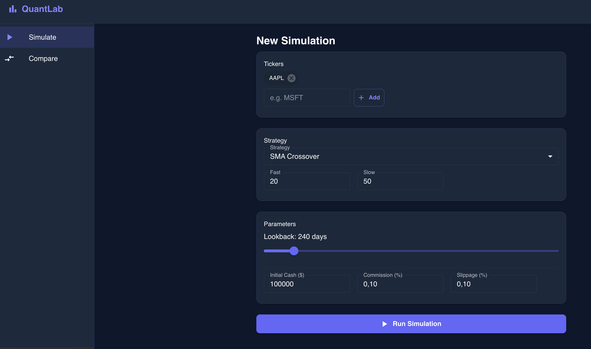
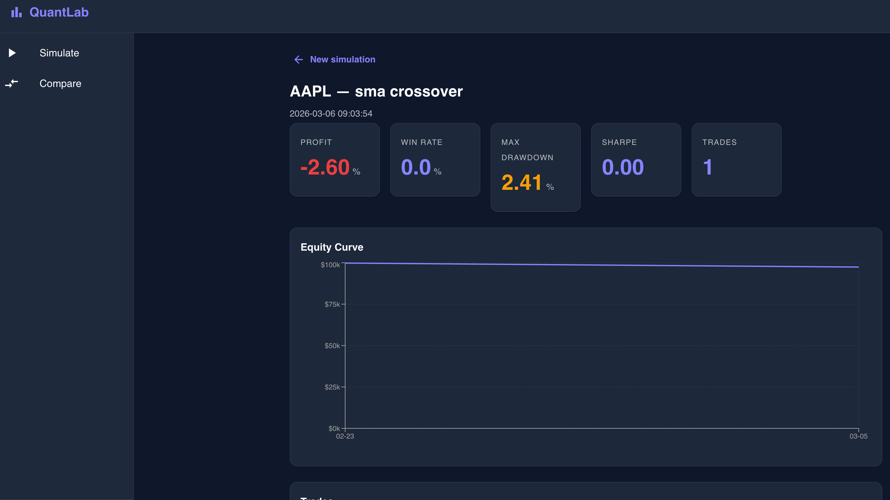

# QuantLab – Trading Strategy Simulator

QuantLab es una aplicación web que permite **probar y comparar estrategias de trading utilizando datos históricos reales del mercado**.

El objetivo es **evaluar estrategias de inversión sin riesgo**, analizando métricas como rentabilidad, drawdown o ratio de Sharpe antes de aplicarlas en trading real.

---

## Qué hace el proyecto

La aplicación permite:

- Simular estrategias de trading sobre acciones reales
- Analizar resultados con métricas financieras
- Visualizar la evolución del capital (equity curve)
- Comparar diferentes estrategias

Todo se basa en **datos históricos del mercado**.

---

## Screenshots

- Carpeta de Docs
### Simulación

Aquí el usuario configura la simulación:

- activo (ticker)
- estrategia
- parámetros
- capital inicial



---

### Resultados

Después de ejecutar la simulación se muestran métricas clave:

- Profit
- Win Rate
- Max Drawdown
- Sharpe Ratio
- Número de trades
- Curva de capital



---

## Tecnologías utilizadas

### Backend

- Python
- FastAPI
- SQLAlchemy
- PostgreSQL
- yfinance

### Frontend

- React
- Vite
- Typescript

### Infraestructura

- Docker
- Docker Compose

---

## Arquitectura del proyecto

```
backend/
   API REST
   motor de simulación
   conexión a base de datos

frontend/
   interfaz de usuario
   dashboard de simulaciones

database/
   PostgreSQL para guardar simulaciones y resultados
```

---

## Cómo ejecutar el proyecto

### 1. Clonar el repositorio

```bash
git clone https://github.com/tuusuario/quantlab.git
cd quantlab
```

---

### 2. Backend

Abrir terminal en `backend`

```bash
source .venv/bin/activate
PYTHONPATH="$PWD/src" uvicorn quantlab.main:app --reload --port 8000
```

API disponible en:

```
http://127.0.0.1:8000/docs
```

---

### 3. Frontend

Abrir otra terminal en `frontend`

```bash
npm install
npm run dev
```

Aplicación disponible en:

```
http://localhost:5173
```

---

## Métricas analizadas

Las simulaciones calculan:

- Profit (%)
- Win Rate
- Max Drawdown
- Sharpe Ratio
- Número de operaciones

Estas métricas permiten **evaluar la calidad de una estrategia de inversión**.

---

## Estado del proyecto

Proyecto funcional que permite:

- crear simulaciones
- probar estrategias
- visualizar resultados

Próximas mejoras posibles:

- más estrategias
- optimización de parámetros
- integración con brokers
- análisis de noticias macro

---

## Autor

Proyecto desarrollado como **simulador de estrategias de trading cuantitativo** para analizar decisiones de inversión basadas en datos.